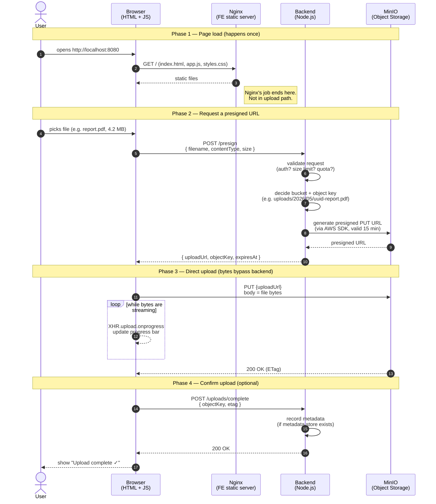

# MinIO Object Storage Project

Project memory — read this first when resuming work. Update as decisions are made.

## Goal

Build a 3-service file upload system where the browser uploads files **directly** to MinIO using presigned URLs. The Node.js backend coordinates but never proxies file bytes (so it never becomes a bandwidth bottleneck).

## Architecture

```
┌──────────────┐      ┌──────────────┐      ┌──────────────┐
│   Frontend   │      │   Backend    │      │    MinIO     │
│ (Nginx + JS) │ ───▶ │  (Node.js)   │ ───▶ │   (Server)   │
│  Port 8080   │      │  Port 3000   │      │  Port 9000   │
└──────────────┘      └──────────────┘      └──────────────┘
       │                                            ▲
       │       Direct upload (presigned URL)        │
       └────────────────────────────────────────────┘
```

### Responsibility split

| Concern                      | Frontend | Backend | MinIO |
| ---------------------------- | :------: | :-----: | :---: |
| Pick file from user          |    ✅    |         |       |
| Decide bucket / object key   |          |   ✅    |       |
| Issue presigned URL          |          |   ✅    |       |
| Receive file bytes           |          |         |  ✅   |
| Show progress bar            |    ✅    |         |       |
| Persist files                |          |         |  ✅   |
| Auth / access control        |          |   ✅    |       |

### Upload flow (happy path)

1. User picks a file in the browser.
2. Frontend → Backend: "I want to upload `report.pdf`, 4.2 MB."
3. Backend decides bucket + object key, asks MinIO for a presigned PUT URL (valid ~15 min).
4. Backend → Frontend: returns the presigned URL.
5. Frontend `PUT`s the file directly to that URL, tracking progress via `XHR.upload.onprogress`.
6. MinIO stores it and returns `200`.
7. Frontend → Backend (optional): "upload finished" — backend records metadata if needed.

## Sequence diagram



### Plain-text fallback

```
User    Browser     Nginx     Backend     MinIO
 │         │          │          │          │
 │ open    │          │          │          │
 │────────▶│  GET /   │          │          │
 │         │─────────▶│          │          │
 │         │◀─────────│ HTML/JS  │          │
 │         │  (Nginx done)       │          │
 │ pick    │                     │          │
 │ file    │                     │          │
 │────────▶│  POST /presign      │          │
 │         │────────────────────▶│          │
 │         │                     │ generate │
 │         │                     │─────────▶│
 │         │                     │◀─────────│ presigned URL
 │         │◀────────────────────│ { url }  │
 │         │                                │
 │         │  PUT file bytes (direct)       │
 │         │───────────────────────────────▶│
 │         │  ↻ progress events (local)     │
 │         │◀───────────────────────────────│ 200 OK
 │         │  POST /uploads/complete        │
 │         │────────────────────▶│ record   │
 │         │◀────────────────────│ metadata │
 │◀────────│  "Upload complete"             │
```

### Failure paths to plan for (not drawn, but real)

- **Presign request fails** (4xx/5xx from backend) → show error, no upload starts.
- **Presigned URL expired** before user hit upload → MinIO returns `403`, frontend requests a fresh URL.
- **Network drops mid-upload** → progress stops; offer retry. Retry restarts from byte 0 unless using multipart.
- **Browser tab closed mid-upload** → MinIO discards the partial PUT; the object key is never created (no orphan to clean up). For multipart, orphan parts exist — needs a lifecycle rule.
- **MinIO down** → presign succeeds (it's a signing operation, no MinIO call needed for v4 sig — but the SDK call to MinIO will fail). Backend returns 503.

## Working principles

- **Design before implementation.** Agree on architecture/decisions before writing code or Dockerfiles.
- **Backend never proxies file bytes.** It only issues presigned URLs and stores metadata. Any proposal that violates this rule needs an explicit reason.
- **Single `docker-compose.yml`.** All three services run as containers on one Docker network. Local dev mirrors the production shape.

## Open design questions

Decide before coding. Mark as ✅ once decided and record the decision below.

- [ ] **Auth** — does the backend authenticate users before issuing presigned URLs, or is it open/internal-only for now?
- [ ] **Bucket strategy** — one bucket for everything, or one per tenant/user/category?
- [ ] **Metadata storage** — does the backend need a database (Postgres? SQLite?) to track uploads, or is MinIO the only source of truth?
- [ ] **File size limits** — small files only (single PUT), or large files needing multipart upload?
- [ ] **Public access** — should uploaded files be downloadable later via presigned GET, public URLs, or never?

## Decisions log

_(Add each decision here with date + short rationale.)_

- _none yet_

## Progress

- [x] **2026-05-15** — Project goal captured in `ai_chat.md`.
- [x] **2026-05-15** — High-level architecture agreed (3 services, presigned-URL flow).
- [x] **2026-05-15** — Sequence diagram drafted (Phase 1–4: load, presign, upload, confirm).
- [ ] Decide open design questions above.
- [ ] Scaffold `docker-compose.yml` with the three services.
- [ ] Implement Node.js backend: `POST /presign` endpoint.
- [ ] Implement frontend: file picker + progress bar.
- [ ] Smoke test: upload a file end-to-end.

## Files in this repo

- `ai_chat.md` — original brief / requirements.
- `CLAUDE.md` — this file (project memory).
